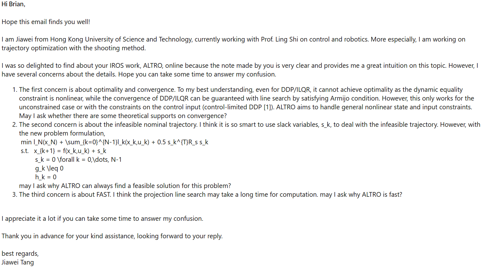
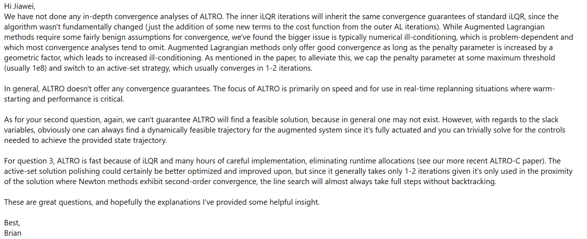

[toc]

# Trajectory optimization

Trajectory optimization can be categorized into **direct collocation method** and **shooting method**.

* **Direct collocation method** eliminates the system dynamics constraints, the control inputs are calculated using inverse dynamics.
* **Shooting method** considers the control inputs as the decision variables and the trajectory can be obtained by forward simulation using system dynamic equation. Originally, shooting method is used to solved ODE problems, a concise tutorials on shooting method can be found [here](https://www.youtube.com/watch?v=ZMgikZ-lcS8). 
* A good course on optimal control is [here](https://github.com/Optimal-Control-16-745),  hope Zac will make this repo always public.

## ALTRO-C: A Fast Solver for Conic Model-Predictive Control

[PDF](http://roboticexplorationlab.org/papers/ALTRO_MPC.pdf)   [code](https://github.com/RoboticExplorationLab/altro-mpc-icra2021)                           Brian E. Jackson, Tarun Punnoose, Daniel Neamati, Kevin Tracy, Rianna Jitosho, Zachary ManchesterAdopt 

Adopt ALTRO to an MPC framework with convex  conic  constraints, provides various example with code.

Key complements are almost same as ALTRO:

* use ILQR as inner solver

* modify the augmented Lagrangian formulation to support second-order cone constraints

  from
  $$
  \mathcal{L}_A(x)=f(x)-\lambda^{T}C(x)+\mu\frac{1}{2}c(x)^Tc(x)
  $$
  to
  $$
  \mathcal{L}_A(x)=f(x)+\frac{1}{2\mu}(\|\lambda-\mu c(x)\|^2-\|\lambda\|^2)
  $$
  or within projection to $\mathcal{K}$
  $$
  \mathcal{L}_A(x)=f(x)+\frac{1}{2\mu}(\Pi_{\mathcal{K}}\|\lambda-\mu c(x)\|^2-\|\lambda\|^2)
  $$

* 

## ALTRO: A Fast Solver for Constrained Trajectory Optimization

[PDF](https://ieeexplore.ieee.org/document/8967788)    [NOTE on AL-ILQR](https://bjack205.github.io/papers/AL_iLQR_Tutorial.pdf)   [code]()             By Taylor A. Howell; Brian E. Jackson; Zachary Manchester

A cool paper on solving constrained trajectory optimization problem with direct collocation method and shooting method. The main framework is based on iLQR/DDP with lots of tricks from optimization. The author also provides us a note of AL-ILQR, which is very useful.

The main contributions are as follows:

* (From [11]) Adopt Augmented Lagrangian methods to tackle $g(x_k,u_k)\leq 0$ and $h(x_k,u_k)=0$. The idea is similar to ADMM, which is iteratively updating variables and  Lagrangian multipliers. Increasing the Lagrangian multipliers for penalization until convergence. (*Question: will it convergence with linearlization?*)

* Projection line search method for solution polishing. (*Question:  convergence rate?*)

* A method for initializing DDP with an infeasible state trajectory. The idea is also from optimization that using slack variables to solve the problem. (*Question: but why finally it will converge to $s_k =0 $?*) 

* A numerically robust square-root formulation of the DDP algorithm. (Haven't read)

* A strategy for solving minimum-time problems with DDP. 

  Since the number of state and control inputs are fixed in the nominal trajectory, to minimize the time horizon, they treat $\Delta t$ as optimizing parameter and and add an additional cost term, $\sum_{k=0}^{N-1}R_{\tau}\tau_k^2$, to objective and try to optimize it.

  Another formulate of the objective is mentioned in Zac's optimal control course:
  $$
  J = l_N(x_N)+\tau\sum_{k=0}^{N-1}l_k(x_k,u_k)
  $$
  Similar concerns is whether it can converges and achieve optimality.
  $$
  \dots s
  $$
  

This paper is sooo cool as it combines control and optimization to solve the robotic problem. I just has some concerns on 1) **optimality** ; 2) **convergence**; 3) **convergence rate**. 

Responses from Brian on my questions: so nice 

## Minimum Snap Trajectory Generation and Control for Quadrotors
[PDF](https://ieeexplore.ieee.org/stamp/stamp.jsp?tp=&arnumber=5980409)    [code]()    [code by me](https://github.com/Garyandtang/ELEC5660-2021/tree/main/project1/proj1phase2)                                                By Daniel Mellinger and Vijay Kumar  

Classic trajectory generation paper with high citation. Major contributions on a **nonlinear controller** for quadrotor and a minimum snap **trajectory generation** method.

The trajectory generation is direct collocation method, it does the time allocation for all waypoints and uses polynomial curves to fit a smooth trajectory  between all watchpoints. The  problem is formulated as a **quadratic programming** with equality constraints, hence it can be easily solved with convex toolbox. The reason why this method works is the quadrotor is differentially flat $[x,y,z,\psi]^{T}$, which is proved in this paper.

The nonlinear controller: to be done once I am working on this

Some drawbacks:

* **Time allocation** should be done at the very beginning, how to allocate the time efficiently deserve to study. One paper by Gao Fei study optimal time allocation is [here](https://ieeexplore.ieee.org/stamp/stamp.jsp?arnumber=8593579).

* **Dynamic infeasible.** Even through they proved that the quadrotor is differentially flat, the pitch and roll are not considered here. One method to solve this problem is that  using **inverse dynamics** to transfer pitch to force to acceleration and add it to constraint during optimization. I am not pretty sure about the singularity issue, deserve to study.