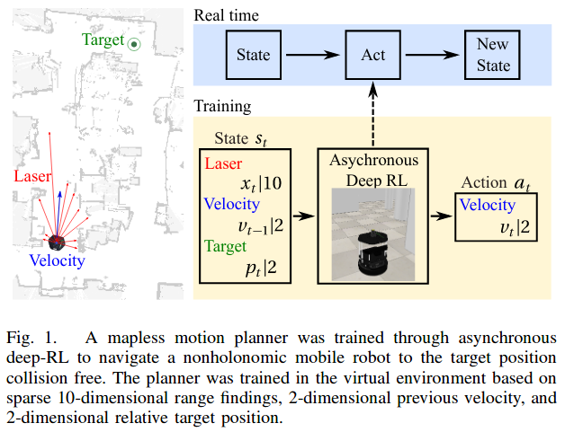
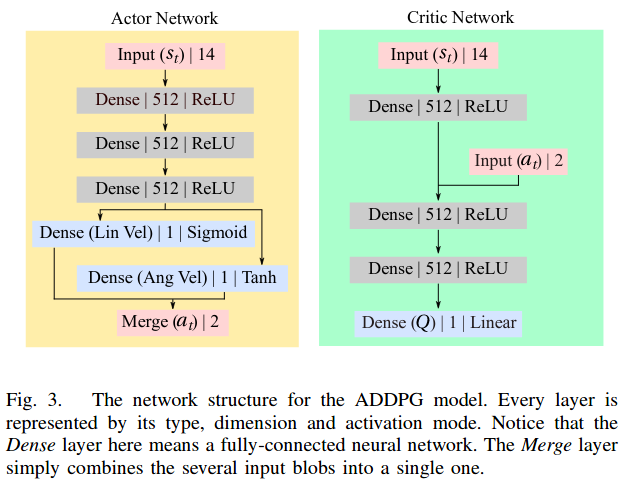

[toc]

# Learning-based control

Most existing well-developed controller are with PID and MPC. However, PID is simply a linear controller while MPC requires to have a well modeling of the system dynamics. Many robotic applications are with highly nonlinear system dynamics. In many applications, we use polynomial fitting to model the motor and use linear system to approximate the nonlinear. Then we have these questions:

* Can we design a nonlinear controller to control the robot?

  It is hard, coz lots of stuff are coupled with each other, it is hard to derive a good nonlinear controller to control the robot. Hope I can find a good paper to solve this issue.

* Can we learn a nonlinear controller?

  Maybe yes, that is why we have this learning-based control.

## Virtual-to-real deep reinforcement learning: Continuous control of mobile robots for mapless navigation
[PDF](https://ieeexplore.ieee.org/abstract/document/8202134)    [code]()    [code by me](https://github.com/Garyandtang/RL_position_control_gazebo)                                                 By Lei Tai; Giuseppe Paolo; Ming Liutai

It may be the first paper using RL in mobile robot navigation. The key idea here is using sparse Laser measurement to do navigation task in a mapless environment. The controller/agent is modified DDPG, so call Asynchronous DDPG (*Qeustion: is it similar to A3C?*). The experiments are done in VREP and real robot. The contributions are:

* First paper applies RL in mapless mobile robot navigation.
* Outperform the SOTA planner, move base, in spare laser setting.
* Demo in real-world robot without fine-turning (*Question: why?*)

Overall architecture:

Network structure:

Reward function:
$$
r(s_t,a_t)=\begin{cases}
r_{arrive} ~~\rm{if} ~ d_t <c_d\\
r_{collision} ~~ \rm{if} \min_{x_t} < c_o\\
c_r(d_{t-1}-d_t)
\end{cases}
$$
Some thinking:

* The reward function only penalizes the state, actually only penalizes the position $[x,y]^T$, not any information on $\theta$ and control input, $u$. Can we borrow the idea of optimal control, using LQR performance index to design the reward function?

* I have not idea how to train a good model, hope someone can give me the answer.

* How to direct use this controller from virtual to real world without fine-turning?

  The author said it is because of the sparse Lidar measurement without further explanation .