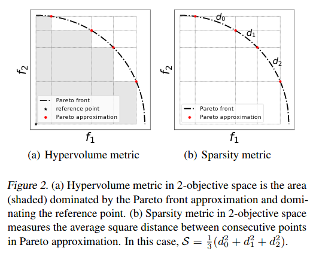
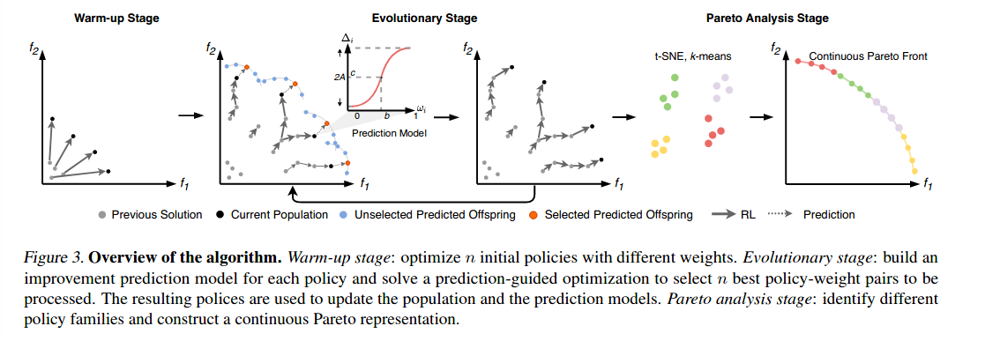
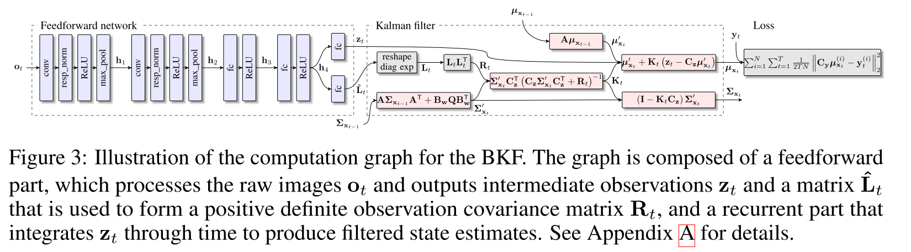

[toc]

# Learning

Some papers on learning are recorded here.

## Prediction-Guided Multi-Objective Reinforcement Learning for Continuous Robot Control

[PDF](https://people.csail.mit.edu/jiex/papers/PGMORL/paper.pdf)  [code](https://github.com/mit-gfx/PGMORL)  [web](http://pgmorl.csail.mit.edu/)   [talk](https://people.csail.mit.edu/jiex/papers/PGMORL/talk.mp4)                                          By Jie Xu,  Yunsheng Tian Pingchuan Ma, Daniela Rus,  Shinjiro Sueda, Wojciech Matusik

This paper aims to deal with the control problems with conflicting objectives (like speed and energy). Key idea is based on multi-objective reinforcement learning and the authors propose an efficient evolutionary learning alogirhtm to find the pareto set approximation for continuous robot control problems.

Multi-objective optimization
$$
\max_\pi \mathbf{F}(\pi)=\max_\pi[f_1(x),f_2(x),\dots, f_m(x)]
$$
Contributions:

* Provide the performance metric for multi-objective reinforcement learning : Pareto-optimality

  

* Prediction-guided MORL: Reduce computation cost

  

* Continuous Pareto Representation

  * Get a set of Pareto optimal policies
  * Classification with t-SNE to get policy family
  * A continuous Pareto representation is then constructed by **linearly interpolating** the policies inside the same family. 
    *  *Although the deep neural networks are not linearly co-related, we surprisingly find that by computing a dense Pareto approximation set and conducting the Pareto analysis, such intra-family interpolation works successfully* (**Question: WHY!)**
    * The relative errors on most problems are smaller than 1%

The idea of this paper is cool but I did not find how to interpolate the policy from their code. Need to spend time on that.

## Backprop KF: Learning Discriminative Deterministic State Estimators

[PDF](https://papers.nips.cc/paper/2016/file/697e382cfd25b07a3e62275d3ee132b3-Paper.pdf)                                                         By Tuomas Haarnoja, Anurag Ajay, Sergey Levine, Pieter Abbeel Guang-Zhong Yang

This paper draws a connection between discriminative probabilistic state estimators (like Kalman filter) and recurrent computation graphs (like RNN). And train an end-to-end model to handle state estimation problem with raw image as input. The results show significant improvement over both standard generative methods and standard recurrent neural networks.

* Generate model aims to estimate the **distribution** over state observation sequences $o_{1:T}$ as originating from some underlying hidden state $x_{1:T}$. It is hard to handle rich sensory observations like images. **Joint distribution** or $P(X|Y=y)$

* A discriminative model is a model of the conditional probability of the target Y, given an observation x, symbolically, P ( Y | X = x ). **Conditional distribution**

I think it is nothing special. To my understanding on this paper, it just learn a feature detector and  combines it with Kalman filter for state estimation.
$$
\nabla_{\theta} \mathcal{L}(\theta) = \sum_{t=1}^T\frac{dz_t}{d\theta}\frac{ds_t}{dz_t}\frac{d\mathcal{L}}{ds_t}
$$

