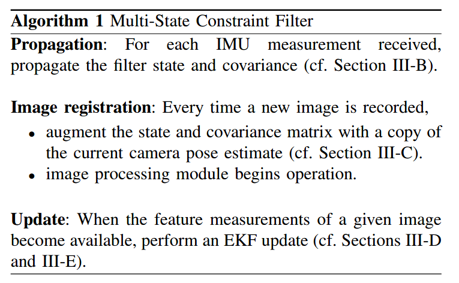

[toc]

# Estimation

References on state estimation, visual odometry and SLAM are archived here. Most works are on filter-based methods and optimization-based method.

## A Multi-State Constraint Kalman Filter for Vision-aided Inertial Navigation

[PDF](https://www-users.cs.umn.edu/~stergios/papers/ICRA07-MSCKF.pdf)                       													         By Anastasios I. Mourikis and Stergios I. Roumeliotis

EKF-based algorithm for real-time visual inertial navigation. Proposed a measurement model taht is able to express the geometric constraints that arise when a static feature is observed from multiple camera poses.

**Advantages**:

* VS VO: scale recovery.
* VS ASKF: tight  coupling method, can add constraints between different camera poses
* VS feature-based method: improve the computation efficiency.

**Algorithm**:

1. start with an initial pose: 
2. Time update with IMU to get a bundle of camera poses. Augmented camera poses to the state vector
3. Track features during process.
4. When a tracked feature is lost, measurement update with proposed measurement model
   1. Triangulate  to generate features poses
   2. project to the null space of feature space **(should read in depth)**
5. Slide windows to handle remove out-of-date camera poses

**Some understanding:**

* Step 4 can be treated as bundle adjustment but only handle the features.
* The constraints between different camera poses is the reprojection error.

