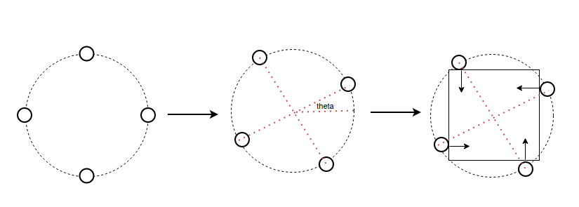
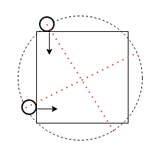

[toc]

# Multi-robot System

Multi-robot system is an important research direction  in robotics. Research topics include formation control, cooperation control, and so on. 

**Graph theory** and and **game theory** are commonly used to analyze multi-robot system and they  provide us useful tools to deal with multi-robot system.

* Two good references on graph theory are:
  * [Consensus and Cooperation in Networked Multi-Agent Systems](https://ieeexplore.ieee.org/stamp/stamp.jsp?tp=&arnumber=4118472)
  * [Controllability of  Multi-Agent  Systems  from  a  Graph-Theoretic  Perspective](https://epubs.siam.org/doi/pdf/10.1137/060674909)

* References on game theory are:


## Formation-based Multi-robot Collaborative control

By Jiawei Tang

This is a note on my understanding on formation-based multi-robot collaborative control. A simple and preliminary controller is proposed. Several questions are raised for current/future research.

### Collaborative controller

consensus control -> formation control -> formation + pose control

**Consensus control**

Control law:
$$
\dot{s}_i(t)= \sum_{j\in N_i}(s_j(t)-s_i(t))\\
\dot{s}(t)=-L s(t)
$$
Deal with offset: let offset converge to zero
$$
\dot{s}(t)=-L s(t) + offset
$$
Matlab implementation:

```matlab
%{
Simple average consensus algorithm with graph theory
By deal with the offset of init state
Agents will converge to the origin
%}
% system paramters

states = [-34,  0, 3;
           1, -23, 0;
           0,  0, 0]';

A = [0, 1, 1;
     1, 0, 1;
     1, 1, 0];
D = diag([2,2,2]);
L = D - A;
dt = 0.03;
tar_state = [1,0,0];

for t = 0 : dt: 9
    offset = sum(states)/3-tar_state;
    offset_all = [offset;offset;offset];
    % consensus controller
    s_dot = -L*(states)-offset_all
    states = states  + dt*s_dot
    plot_animation(states);
end


```

Plot animation:

```matlab
function plot_animation(states)
    nums = size(states,1);
    for i = 1:nums
        if i == 1
            plot(states(i,1), states(i,2),'-p','MarkerFaceColor','red','MarkerEdgeColor','red','MarkerSize',8);

            hold on
        else
            plot(states(i,1), states(i,2),'-p','MarkerFaceColor','red','MarkerEdgeColor','red','MarkerSize',8);
        end
    end
    xlim([-5 5])
    ylim([-5 5])
    hold off;
    uesless = input('enter');
end
```


**Distance based formation control**

Matlab implementation:

```matlab
%{
Simple average consensus algorithm with graph theory
%}
% system paramters

states = [-3,  0, 3;
           1, -1, 0;
           0,  0, 0]';

A = [0, 1, 1;
     1, 0, 1;
     1, 1, 0];
D = diag([2,2,2]);
L = D - A;

dt = 0.03;
s_dot = zeros(3,3);
d_safe = 1*[0.5 1 0.5 0 0 0 ...
            0.5 0.5 0.5 0.5 0 0 ...
            1 0.5 0 0.5 0 0];
tar_state_list = [0,5-0.1677 ,0
                  3,5-0.1677,0
                  3,-0.1677,0;
                  0,-0.1677,0];
tar_state_list=[0,-0.1677,0;
                0,5-0.1677 ,0;
                  3,5-0.1677,0
                  3,-0.1677,0;
                  0,-0.1677,0];

for j = 1:10
    tar_state = tar_state_list(mod(j-1,4)+1,:);
    for t = 1:dt:4
        states= dist_consensus_controller(states, tar_state,d_safe,dt);
    end
    disp('second')
    if j ==1 
    for t = 1:dt:3
        tar_lists = [   0    0 0;
              -0.5 -0.5 0;
              0 -1 0];
        states= consensus_pose_controller(states, tar_state,d_safe,tar_lists,dt);
    end
    for t = 1:dt:3
        tar_lists = [   -0.5    0 0;
              0 -0.5 0;
              0.5 0 0];
        states= consensus_pose_controller(states, tar_state,d_safe,tar_lists,dt);
    end
    
    end
end

function states = dist_consensus_controller(states, tar_state,d_safe,dt)
    count = 1;
    s_dot = zeros(3,3);
    offset = sum(states)/3-tar_state;
    offset_all = [offset;offset;offset];
    for i = 1:3
        for j = 1:3
            for k = 1:2
                s_dot(i,j) = s_dot(i,j)-(abs(states(mod(i-1+k,3)+1,j)-states(i,j))-d_safe(count))*(states(i,j)-states(mod(i-1+k,3)+1,j));
                count = count +1;
            end
        end
    end
    s_dot = s_dot - offset_all;
    states = states  + dt*s_dot
    plot_animation(states);
end

function states = consensus_pose_controller(states, tar_state,d_safe,tar_lists,dt)
    count = 1;
    s_dot = zeros(3,3);
    offset = sum(states)/3-tar_state;
    offset_all = [offset;offset;offset];
    for i = 1:3
        for j = 1:3
            for k = 1:2
                s_dot(i,j) = s_dot(i,j)-(abs(states(mod(i-1+k,3)+1,j)-states(i,j))-d_safe(count))*(states(i,j)-states(mod(i-1+k,3)+1,j));
                count = count +1;
            end
        end
    end
    s_dot = s_dot - offset_all-5*(states-tar_lists);
    states = states  + dt*s_dot
    plot_animation(states);
end
```


**Formation + Pose Control**

Treat the big formation as a whole, and control the pose of the center to control the formation, an illustrated example of four robots is shown here:



For two robot case, we also need to make the rotational center equal to the center of the object. We can borrow the bicycle model to analyze this case




Questions:

1. Comparing formation control and force analysis
2. Two robots and bicycle model
3. Relative formation control

## Adapting to Performance Variations in Multi-Robot Coverage

[PDF](https://web.stanford.edu/~schwager/MyPapers/PiersonEtAlICRA15AdaptivePerformanceCoverage.pdf)                           By Alyssa Pierson, Lucas C. Figueiredo, Luciano C. A. Pimenta, and Mac Schwager

This paper proposes an approach on solving multi-robot coverage problem subject to actuator variations. The key idea are:

1. Control law is based on position-based consensus algorithm.
2. Position is determined by Voronoi based coverage control.
3. Actuator variations and position distance are with linear relationship.

Some simple idea:

1. Define a good function to evaluate  actuator variations  to replace $f(K)=\|K\|$
2. Online $\hat{K}$ estimation.

Remarks

1.  [18] is a good paper on consensus.
2. [3]/[5] provide a complete discussion on Voronoi based coverage control.

